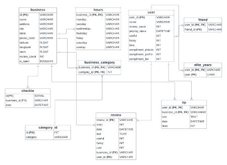
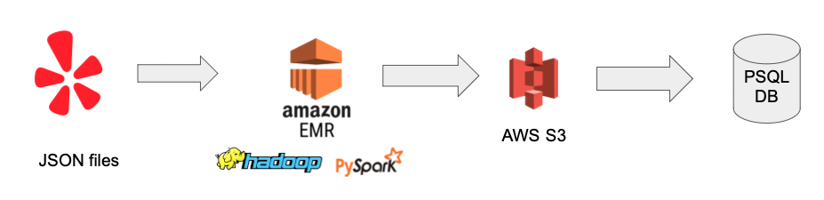

# Yelp_DataModelling

This project aims at readying yelp [dataset](https://www.yelp.com/dataset/documentation/main) consisting of review, user, ratings, business and  tips json files.

The data is read, cleaned, normalized and written in csv format, on hadoop cluster using Apache spark. The csv files are stored into Postgres SQL.

There are some interesting insights mined using sql analytical queries

Next Item Set mining is performed on grouping businesses visited by users.

The architecture to process the data includes EMR cluster on AWS. 

Next we do item set mining, grouping services together based on visited together by users. This is done using using SQL joins on review table. The minimum support is 50 users.

The outcome shows that grouped have similar attributes and they are in close vicinity

These patterns can help cluster businesses and users, further improving marketing campaigns and recommendation algorithms.
